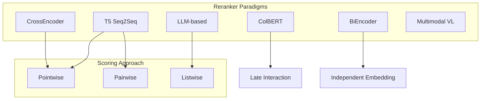
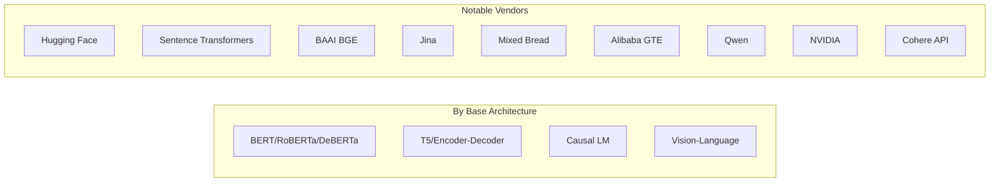

# Reranker Architectures and Models Reference

Research summary from Hugging Face, Sentence Transformers, Cohere, and academic sources—excluding your repository.

---

## 1. Architecture Categories

---

## 2. CrossEncoder (Encoder-Only)

**Mechanism:** Query and document are concatenated as `[CLS] Query [SEP] Document` and processed in one forward pass. Full cross-attention between all query and document tokens. Output: single relevance score.

**Typical usage:** `AutoModelForSequenceClassification` or `sentence_transformers.CrossEncoder` with a classification head on `[CLS]`.

### 2.1 BERT/RoBERTa/MinLM

| Model Family          | Examples                                                | Notes                                           |
| --------------------- | ------------------------------------------------------- | ----------------------------------------------- |
| **MS MARCO MiniLM**   | `cross-encoder/ms-marco-MiniLM-L2/L4/L6/L12-v2`         | Sentence Transformers official, 32M–125M params |
| **MS MARCO TinyBERT** | `cross-encoder/ms-marco-TinyBERT-L2-v2`                 | ~70M params, fastest                            |
| **MS MARCO ELECTRA**  | `cross-encoder/ms-marco-electra-base`                   | ELECTRA encoder                                 |
| **STS/RoBERTa**       | `cross-encoder/stsb-roberta-base`, `quora-roberta-base` | STS, duplicate questions                        |
| **NLI/DeBERTa**       | `cross-encoder/nli-deberta-v3-base`                     | Entailment/contradiction                        |

### 2.2 BGE (BAAI / FlagEmbedding)

| Model                                       | Size  | Architecture                           |
| ------------------------------------------- | ----- | -------------------------------------- |
| `BAAI/bge-reranker-base`                    | Base  | BERT-like cross-encoder                |
| `BAAI/bge-reranker-large`                   | Large | Higher accuracy                        |
| `BAAI/bge-reranker-v2-m3`                   | ~0.6B | Multilingual v2                        |
| `BAAI/bge-reranker-v2.5-gemma2-lightweight` | -     | Gemma2 backbone, layerwise compression |
| `BAAI/bge-reranker-v2-minicpm-layerwise`    | 2.72B | MiniCPM backbone, configurable layers  |
| `BAAI/bge-reranker-v2-gemma`                | -     | Gemma backbone                         |

**Inference:** `FlagEmbedding.FlagReranker` or `LayerWiseFlagLLMReranker` for layerwise models.

### 2.3 Jina

| Model                                       | Size | Notes                     |
| ------------------------------------------- | ---- | ------------------------- |
| `jinaai/jina-reranker-v1-tiny-en`           | 33M  | Small, fast               |
| `jinaai/jina-reranker-v1-turbo-en`          | 38M  | Balanced speed/quality    |
| `jinaai/jina-reranker-v2-base-multilingual` | 0.3B | Multilingual, widely used |
| `jinaai/jina-reranker-v3`                   | -    | Updated 2025              |

### 2.4 Mixed Bread AI (mxbai)

| Model                                      | Size  | Notes        |
| ------------------------------------------ | ----- | ------------ |
| `mixedbread-ai/mxbai-rerank-xsmall-v1`     | 70.8M | Very small   |
| `mixedbread-ai/mxbai-rerank-base-v1`       | 0.2B  |              |
| `mixedbread-ai/mxbai-rerank-large-v1`      | -     | High quality |
| `mixedbread-ai/mxbai-rerank-base/large-v2` | -     | v2 variants  |

### 2.5 Alibaba GTE

| Model                                        | Size | Base                   |
| -------------------------------------------- | ---- | ---------------------- |
| `Alibaba-NLP/gte-multilingual-reranker-base` | -    | Multilingual           |
| `Alibaba-NLP/gte-reranker-modernbert-base`   | 149M | ModernBERT, 8K context |

### 2.6 Community / ModernBERT

| Model                                           | Notes                                           |
| ----------------------------------------------- | ----------------------------------------------- |
| `tomaarsen/reranker-ModernBERT-base-gooaq-bce`  | ModernBERT, BCE, often strong when domain-tuned |
| `tomaarsen/reranker-ModernBERT-large-gooaq-bce` | Large variant                                   |
| `maidalun1020/bce-reranker-base_v1`             | BCE reranker                                    |

---

## 3. T5 / Seq2Seq Rerankers

**Mechanism:** Query-document pair fed into encoder; decoder generates relevance token(s) (e.g. `"true"`/`"false"`). Score from logits or softmax over these tokens.

### 3.1 MonoT5 (Pointwise)

| Model                           | Base    | Notes                      |
| ------------------------------- | ------- | -------------------------- |
| `castorini/monot5-base-msmarco` | T5-base | MS MARCO, binary relevance |
| `castorini/monot5-3b-msmarco`   | T5-3B   | Larger variant             |

**Scoring:** Typically `P("true")` vs `P("false")` from last decoder position.

### 3.2 DuoT5 (Pairwise)

| Model                          | Notes                                     |
| ------------------------------ | ----------------------------------------- |
| `castorini/duot5-base-msmarco` | Pairwise, compares two passages per query |

**Scoring:** Pairwise comparisons; quadratic in number of candidates.

### 3.3 RankT5 / LiT5

- **RankT5:** T5 fine-tuned with pairwise/listwise ranking losses.
- **LiT5:** Listwise T5 rerankers (e.g. 220M–3B), zero-shot capable.
- **Fusion-in-T5 (FiT5):** Combines text matching, ranking features, and global doc info.

---

## 4. ColBERT (Late Interaction)

**Mechanism:** Shared BERT encoder for query and document; outputs token-level vectors. Relevance via MaxSim over query-document token pairs. Documents can be pre-embedded.

| Model                                  | Notes                                           |
| -------------------------------------- | ----------------------------------------------- |
| `mixedbread-ai/mxbai-colbert-large-v1` | 0.3B, ColBERT-style                             |
| `jinaai/jina-colbert-v2-*`             | Jina ColBERT v2 (multilingual late interaction) |

**Inference:** Document vectors precomputed; query encoded at retrieval time; MaxSim scoring.

---

## 5. LLM-Based Rerankers

### 5.1 Qwen3-Reranker (Causal LM)

| Model                      | Size | Architecture   |
| -------------------------- | ---- | -------------- |
| `Qwen/Qwen3-Reranker-0.6B` | 0.6B | Qwen3 backbone |
| `Qwen/Qwen3-Reranker-4B`   | 4B   |                |
| `Qwen/Qwen3-Reranker-8B`   | 8B   |                |

**Mechanism:** Instruction-aware cross-encoder built on Qwen3; scores via "yes"/"no" token logits with log-softmax. 32K context.

### 5.2 NVIDIA Nemotron

| Model                                   | Size | Base                                   |
| --------------------------------------- | ---- | -------------------------------------- |
| `nvidia/llama-nemotron-rerank-1b-v2`     | 1B   | Llama-3.2-1B, 8K context, 26 languages |
| `nvidia/llama-nemotron-rerank-vl-1b-v2` | -    | Vision-language reranker                |

**Mechanism:** Llama transformer as cross-encoder; relevance via logit scores.

### 5.3 RankGPT / RankLLM (Listwise)

- **RankGPT, RankGemini:** Instruction-based listwise reranking with GPT / Gemini.
- **RankVicuna, RankZephyr:** Open-source listwise LLM rerankers.
- **Framework:** [RankLLM](https://castorini.github.io/rank_llm/) (vLLM, SGLang, TensorRT-LLM).

**Mechanism:** Sliding-window listwise; model orders/ranks multiple passages together via prompts.

---

## 6. Cohere Rerank (API)

**Models:** `rerank-english-v3.0`, `rerank-multilingual-v3.0`, `rerank-v3.5`, `rerank-v4.0`.

**Mechanism:** Proprietary cross-encoder; semantic scoring; v3.5: 4K context; v4.0: 32K context. Access via Cohere API, not open weights.

---

## 7. Multimodal / Visual Rerankers

| Model                                   | Base        | Notes                                    |
| --------------------------------------- | ----------- | ---------------------------------------- |
| `lightonai/MonoQwen2-VL-v0.1`           | Qwen2-VL-2B | Image–query relevance (MonoT5 objective) |
| `nvidia/llama-nemotron-rerank-vl-1b-v2` | -           | Visual document reranking                 |

**Use case:** RAG over images/PDFs without OCR; rerank based on image content and query.

---

## 8. Training Frameworks

| Framework                    | Capabilities                                                                                      |
| ---------------------------- | ------------------------------------------------------------------------------------------------- |
| **Sentence Transformers v4** | `CrossEncoderTrainer`, BCE/other losses, hard negatives mining, `sentence-transformers` tag on HF |
| **FlagEmbedding**            | BGE rerankers, layerwise variants                                                                 |
| **RankLLM**                  | MonoT5, DuoT5, listwise LLMs                                                                     |

**Data format:** Typically `(query, document, label)` or `(query, positive, negative)` with labels/scores.

---

## 9. Summary Diagram

---

## 10. References

- [Hugging Face: Training Reranker Models (Sentence Transformers v4)](https://huggingface.co/blog/train-reranker)
- [Hugging Face Models: reranker tag](https://huggingface.co/models?other=reranker)
- [Sentence Transformers CrossEncoder docs](https://www.sbert.net/docs/cross_encoder/pretrained_models.html)
- [BGE Reranker v2](https://bge-model.com/bge/bge_reranker_v2.html)
- [RankLLM](https://castorini.github.io/rank_llm/)
- [CrossEncoders, ColBERT, LLM Rerankers (Medium)](https://medium.com/@aimichael/cross-encoders-colbert-and-llm-based-re-rankers-a-practical-guide-a23570d88548)
- [Qwen3 Embedding / Reranker](https://qwenlm.github.io/blog/qwen3-embedding/)
